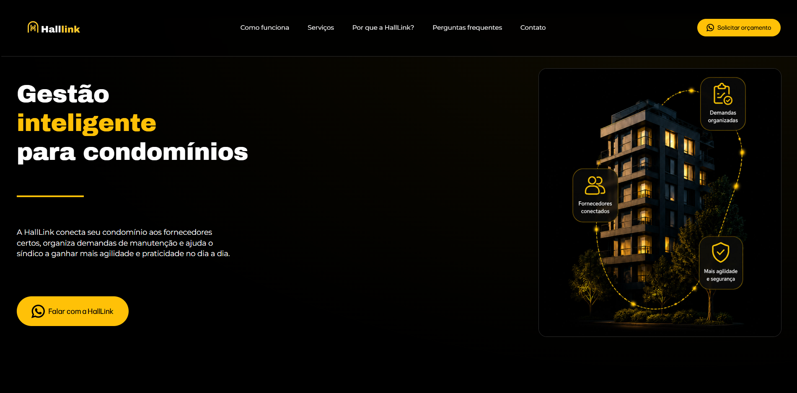

# 🚀 HallLink

<p align="center">
  <strong>Landing page institucional desenvolvida de ponta a ponta, com foco em experiência do usuário, responsividade e conversão.</strong>
</p>

<p align="center">
  <a href="https://github.com/KaweM/Halllink">📂 Repositório</a>
</p>

## 📸 Preview

<p align="center">
  
</p>

> Interface desenvolvida para apresentar os serviços da HallLink de forma clara, moderna e responsiva, direcionando o usuário para o contato comercial via WhatsApp.

---

## 📋 Sobre o projeto

O **HallLink** é uma landing page institucional desenvolvida para apresentar os serviços da empresa e facilitar a geração de novos contatos.

O projeto foi desenvolvido utilizando **HTML5, CSS3 e JavaScript**, priorizando uma interface responsiva, organização visual e uma navegação simples e intuitiva.

A página conta com diferentes seções para apresentar a empresa, seus serviços e informações relevantes ao visitante, além de recursos interativos desenvolvidos em JavaScript.

---

## 👨‍💻 Minha atuação no projeto

Atuei como **único desenvolvedor responsável pelo projeto**, participando de todas as etapas do desenvolvimento da landing page, desde a concepção visual até a implementação e publicação da aplicação.

### 🎨 Design e planejamento

* Criação do design da landing page;
* Definição da identidade visual;
* Organização da hierarquia visual e das seções;
* Planejamento da experiência de navegação;
* Definição de cores, tipografia, espaçamentos e componentes;
* Adaptação do design para diferentes tamanhos de tela.

### 💻 Desenvolvimento Front-end

* Estruturação da página utilizando HTML5;
* Desenvolvimento da interface utilizando CSS3;
* Implementação da responsividade;
* Desenvolvimento das interações utilizando JavaScript;
* Implementação do menu mobile;
* Desenvolvimento do modal de contato;
* Implementação da seção de perguntas frequentes (FAQ);
* Organização dos arquivos e estilos do projeto.

### 🔧 Versionamento e publicação

* Controle de versão utilizando Git;
* Organização do desenvolvimento através de commits e branches;
* Gerenciamento do código através do GitHub;
* Deploy e publicação da aplicação utilizando Vercel.

### 🚀 Responsabilidade pelo projeto

Fui responsável pelo projeto **de ponta a ponta**, desde a **concepção do design até o desenvolvimento, versionamento e deploy da aplicação**, trabalhando de forma independente em todas as etapas necessárias para colocar a landing page em produção.

---

## 🎯 Objetivo

O principal objetivo do projeto foi desenvolver uma **landing page moderna, responsiva e orientada à conversão**, capaz de:

* Apresentar os serviços de forma objetiva;
* Facilitar a navegação do usuário;
* Criar uma experiência consistente em diferentes dispositivos;
* Utilizar chamadas para ação (CTA) estratégicas;
* Facilitar o contato através do WhatsApp;
* Aplicar boas práticas de desenvolvimento Front-end.

---

## 🛠️ Tecnologias

<div align="center">


</div>

### Front-end

**HTML5**

* Estrutura semântica;
* Organização das seções;
* Elementos de navegação e conteúdo.

**CSS3**

* Flexbox;
* Grid;
* Media Queries;
* Unidades relativas;
* Responsividade;
* Organização de estilos;
* Ajustes de layout para diferentes breakpoints.

**JavaScript**

* Manipulação do DOM;
* Event listeners;
* Controle do menu mobile;
* Modal de contato;
* Sistema de perguntas frequentes;
* Interações da interface.

### Ferramentas

* Git
* GitHub
* Visual Studio Code
* Vercel

---

## ✨ Funcionalidades

### 📱 Menu responsivo

Navegação adaptada para dispositivos móveis, permitindo que o usuário acesse as diferentes áreas da página de maneira simples.

### 💬 Modal de contato

Modal desenvolvido com JavaScript para facilitar o direcionamento do usuário ao contato através do WhatsApp.

### ❓ FAQ interativo

Seção de perguntas frequentes com interação em JavaScript para expandir e ocultar respostas.

### 📐 Layout responsivo

Interface adaptada para diferentes tamanhos de viewport utilizando técnicas de CSS responsivo.

### 🎯 Call to Action

Chamadas para ação posicionadas estrategicamente para direcionar o visitante ao contato comercial.

---

## 🧩 Estrutura do projeto

```text
Halllink/
│
├── assets/
│   └── imagens e recursos visuais
│
├── styles/
│   └── arquivos CSS
│
├── index.html
│
├── menu-mobile.js
├── modal-whatsapp.js
├── perguntas-frequentes.js
│
├── favicon.jpg
└── .gitignore
```

---

## 📱 Responsividade

Um dos principais pontos trabalhados durante o desenvolvimento foi a adaptação da interface para diferentes dispositivos.

Foram utilizados **Media Queries, Flexbox, Grid e unidades relativas** para controlar:

* Organização dos cards;
* Espaçamentos;
* Tamanhos dos elementos;
* Tipografia;
* Navegação;
* Seções da landing page;
* Comportamento em telas menores.

---

## 🧠 Principais desafios

### 1. Responsividade

Foi necessário ajustar o comportamento de diferentes elementos conforme o tamanho da tela, trabalhando com diferentes breakpoints e revisando dimensões, espaçamentos e organização dos componentes.

### 2. Organização da interface

A página possui diversas seções e elementos visuais. A organização dos estilos foi importante para evitar conflitos e facilitar futuras alterações.

### 3. Interações com JavaScript

O projeto exigiu a implementação de funcionalidades utilizando JavaScript, como:

* Menu mobile;
* Modal de contato;
* FAQ;
* Eventos de interação.

---

## 🔄 Processo de desenvolvimento

O projeto foi desenvolvido de forma incremental:

```text
Planejamento
     ↓
Criação do design
     ↓
Estrutura HTML
     ↓
Estilização CSS
     ↓
Responsividade
     ↓
Implementação JavaScript
     ↓
Testes em diferentes resoluções
     ↓
Correções e melhorias
     ↓
Deploy
```

---

## 🚀 Deploy

O projeto foi preparado para hospedagem utilizando a **Vercel**, permitindo a publicação da landing page e integração com o fluxo de versionamento do GitHub.

---

## 🔮 Melhorias futuras

* [ ] Melhorar acessibilidade;
* [ ] Implementar SEO mais completo;
* [ ] Adicionar Open Graph e metatags;
* [ ] Otimizar imagens;
* [ ] Melhorar métricas de performance;
* [ ] Adicionar animações e microinterações;
* [ ] Implementar métricas de conversão;
* [ ] Evoluir a estrutura JavaScript;
* [ ] Adicionar testes automatizados.

---

## 📌 Status

🟢 **Projeto funcional**

O HallLink foi desenvolvido como um projeto profissional e permanece como parte do meu portfólio de desenvolvimento Front-end.

---

## 👨‍💻 Desenvolvedor

### Kauê Miguel

Estudante de **Análise e Desenvolvimento de Sistemas**, com foco no desenvolvimento Front-end e na construção de projetos utilizando tecnologias web.

Tenho interesse em continuar evoluindo principalmente em:

* Front-end;
* JavaScript;
* Back-end;
* Banco de dados;
* Lógica de programação;
* Inteligência Artificial.

### 🔗 Links

<p align="center">
  <a href="https://github.com/KaweM">
    
  </a>
</p>

---

<p align="center">
  <strong>Desenvolvido com HTML, CSS e JavaScript 💻</strong>
</p>
